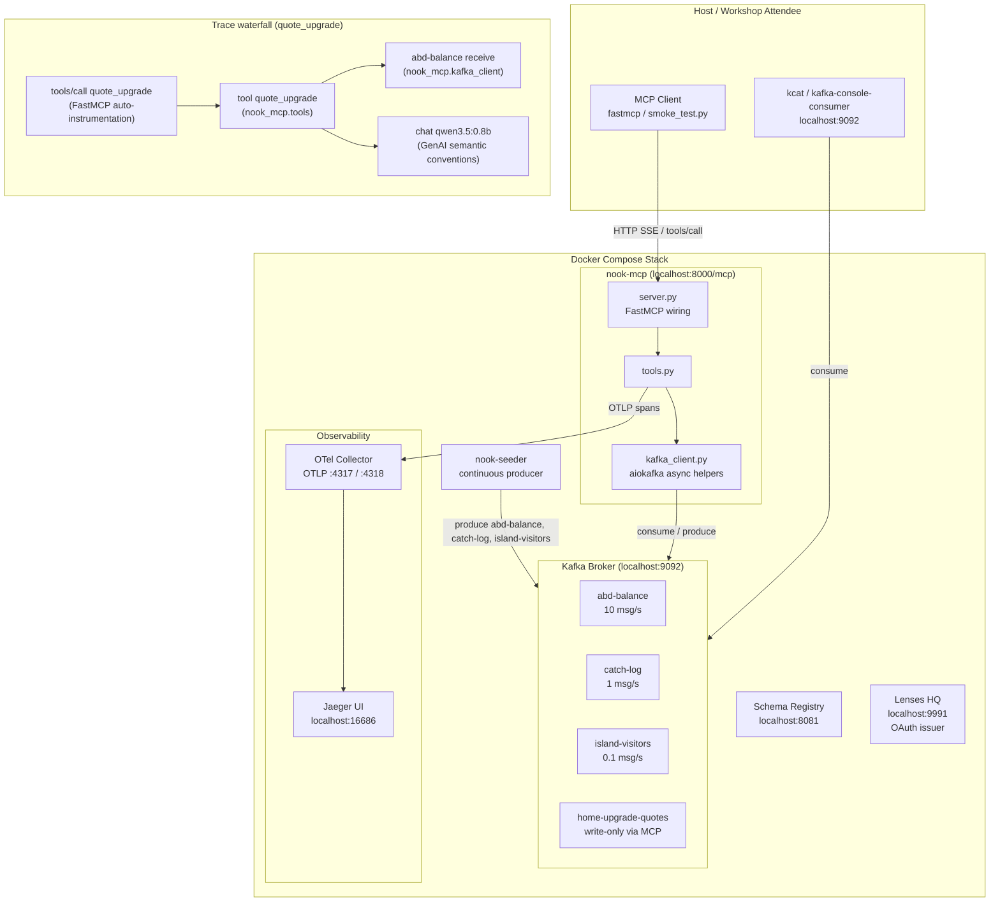
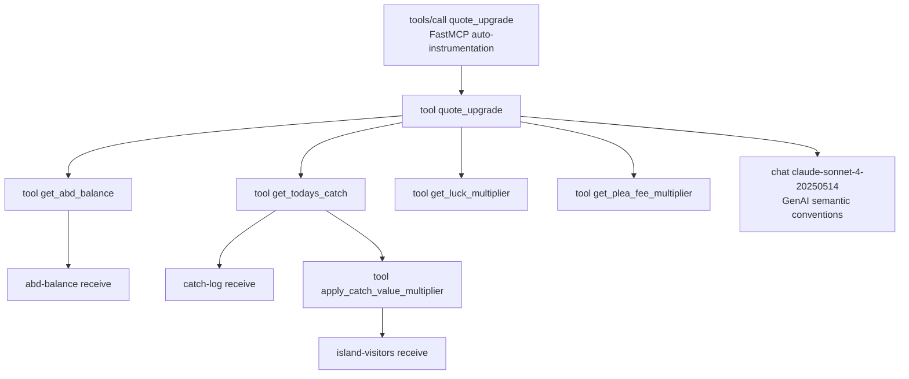

# Architecture

```mermaid
graph TD
    subgraph Host["Host / Workshop Attendee"]
        Client["MCP Client\nfastmcp / smoke_test.py"]
        KCat["kcat / kafka-console-consumer\nlocalhost:9092"]
    end

    subgraph Compose["Docker Compose Stack"]
        subgraph MCP["nook-mcp (localhost:8000/mcp)"]
            Server["server.py\nFastMCP wiring"]
            Tools["tools.py"]
            KafkaClient["kafka_client.py\naiokafka async helpers"]
            Server --> Tools
            Tools --> KafkaClient
        end

        subgraph Kafka["Kafka Broker (localhost:9092)"]
            T1["abd-balance\n10 msg/s"]
            T2["catch-log\n1 msg/s"]
            T3["island-visitors\n0.1 msg/s"]
            T4["home-upgrade-quotes\nwrite-only via MCP"]
        end

        Seeder["nook-seeder\ncontinuous producer"]
        SchemaRegistry["Schema Registry\nlocalhost:8081"]
        LensesHQ["Lenses HQ\nlocalhost:9991\nOAuth issuer"]

        subgraph Observability["Observability"]
            OTelCollector["OTel Collector\nOTLP :4317 / :4318"]
            Jaeger["Jaeger UI\nlocalhost:16686"]
            OTelCollector --> Jaeger
        end
    end

    Client -->|"HTTP SSE / tools/call"| Server
    KCat -->|consume| Kafka
    KafkaClient -->|"consume / produce"| Kafka
    Seeder -->|"produce abd-balance, catch-log, island-visitors"| Kafka
    Tools -->|"OTLP spans"| OTelCollector

    subgraph Spans["Trace waterfall (quote_upgrade)"]
        S1["tools/call quote_upgrade\n(FastMCP auto-instrumentation)"]
        S2["tool quote_upgrade\n(nook_mcp.tools)"]
        S3["abd-balance receive\n(nook_mcp.kafka_client)"]
        S4["chat qwen3.5:0.8b\n(GenAI semantic conventions)"]
        S1 --> S2 --> S3
        S2 --> S4
    end
```

## Trace waterfall — `quote_upgrade`

```mermaid
graph TD
    S1["tools/call quote_upgrade\nFastMCP auto-instrumentation"]
    S2["tool quote_upgrade"]
    S3["tool get_abd_balance"]
    S4["abd-balance receive"]
    S5["tool get_todays_catch"]
    S6["catch-log receive"]
    S7["tool apply_catch_value_multiplier"]
    S8["island-visitors receive"]
    S9["tool get_luck_multiplier"]
    S10["tool get_plea_fee_multiplier"]
    S11["chat claude-sonnet-4-20250514\nGenAI semantic conventions"]

    S1 --> S2
    S2 --> S3 --> S4
    S2 --> S5 --> S6
    S5 --> S7 --> S8
    S2 --> S9
    S2 --> S10
    S2 --> S11
```
